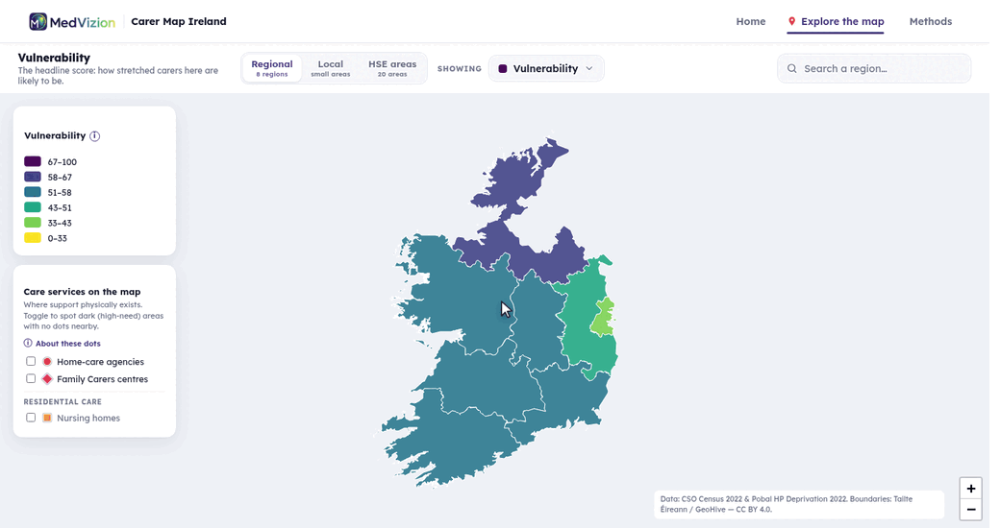
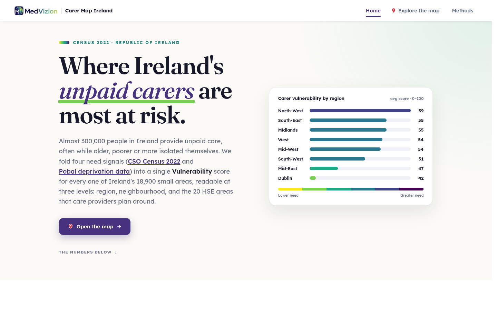

# Carer Vulnerability Map of Ireland

An interactive map of where unpaid carers in Ireland are most vulnerable, and where that
need is least matched by support on the ground. Built for carer-support services and the
people who plan them, at national, regional, and operator level, to see where to direct
help and where to put the next service before carers reach crisis.


**Live:** https://carer-map-ireland.vercel.app



Built in a day with **Claude Code** at the **AI Build Day**, a hands-on workshop led by
Jonathan McCrea as part of the Innovate for Ireland iScholars Innovation Ecosystem event. We
scoped and built the prototype together in the room.

## The problem

Almost 300,000 people in Ireland provide unpaid care (Census 2022), many of them poor,
older, or isolated themselves. Support is allocated off national and regional totals that
hide where strain actually concentrates, so help often arrives after a carer is already in
crisis. And nobody has joined *where the need is* to *where the services already are*. The
data to answer both exists; it just hadn't been brought together.

## What it does

A single page with two views: an editorial **Home** that frames the problem, and a **Map**.
The map has two controls that work independently.



A **Geography toggle** sets how the country is divided:

- **Regional:** the 8 NUTS3 regions, for the national overview.
- **Local:** click a region to drop into its Census small areas (18,919 nationwide).
- **HSE areas:** the 20 HSE Integrated Healthcare Areas, the operator view. Click one to zoom in
  and open a "Target your supply here" card listing its worst small areas, with a CSV export.

A separate **Showing lens** sets what the colour means: the **Vulnerability** headline (a
0-100 percentile-rank composite of carer load, deprivation, age and disability demand, and
isolation), each theme on its own, a **Need vs support** bivariate, and a **Support gap**
lens (a service desert: vulnerability weighted by distance to the nearest support). On top of any lens, a
**Care services** overlay plots the real supply points: home-care agencies, family-carer
centres, and nursing homes.

Every score is a relative **0-100 rank, not a percentage or a count**, and every lens carries
its caveats ([`docs/methods/LIMITATIONS.md`](docs/methods/LIMITATIONS.md)). We map **area-level
rates, not individuals**.

## Built with Claude Code

The data pipeline, the scoring, and the site were all built in a single day with Claude Code,
from a problem brainstormed that morning. It's kept here as a worked example of building a real,
data-backed web app with AI: pull open data without API keys, score it defensibly, and ship an
interactive map. The build conventions are in [`CLAUDE.md`](CLAUDE.md); the data pipeline in
[`scripts/README.md`](scripts/README.md).

## Tech stack

Keyless open data (CSO PxStat, Pobal, HIQA/HSE registers) pre-baked to static JSON, drawn
with Leaflet, deployed on Vercel. Python (pandas / geopandas) for the data prep and
scoring.

## Getting started

```bash
conda env create -f environment.yml
go carer-map-ireland   # cd in + activate the env
```

The site is static, with no build step. Serve `site/` over HTTP so the map's data fetches
work, then open the printed local URL:

```bash
python3 -m http.server --directory site
```

The scoring pipeline lives in `scripts/` (demographics → deprivation → vulnerability →
supply → support gap (service desert) → market gap → target drill-down), documented in
[`scripts/README.md`](scripts/README.md). `site/zoom.html` is just a redirect to
`index.html#map`, kept so old links resolve.

## How the project is laid out

| Where | What |
|---|---|
| [`docs/`](docs/) | The methodology, limitations, and project context. See [`docs/README.md`](docs/README.md) for the index. |
| [`docs/methods/METHODOLOGY.md`](docs/methods/METHODOLOGY.md) | How every score is built, and the established method each rests on. |
| [`docs/methods/LIMITATIONS.md`](docs/methods/LIMITATIONS.md) | What the map can and cannot tell you. |
| [`docs/methods/SOURCES.md`](docs/methods/SOURCES.md) | Every dataset pulled, where it lives, the join keys. |
| [`scripts/README.md`](scripts/README.md) | The data pipeline and how each open source is accessed. |
| [`CLAUDE.md`](CLAUDE.md) | Working conventions for anyone (or any Claude session) building here. |

Folders: `site/` the web app, `scripts/` data prep and scoring, `data/` processed outputs
plus boundaries, `docs/` the write-ups (design, methods, services, concept).

## Data

CSO Census 2022 (PxStat), Pobal HP Deprivation Index 2022, and the HIQA / HSE provider
registers, all free and keyless. Raw pulls are gitignored and re-pulled by scripts; only
processed outputs are committed. We map **area-level rates, not individuals**. Attribution:
CSO (CC BY 4.0), Pobal, and the respective registers (see [`SOURCES.md`](docs/methods/SOURCES.md)).

## Credits

- Built with **Claude Code** (Anthropic).
- Maps with **Leaflet** (BSD-2 licence); the **viridis** colour scale (perceptually uniform,
  colour-blind friendly) is the signature motif.
- Type: **Fraunces** and **Lexend**, both under the SIL Open Font License, served via Google Fonts.
- Geocoding: **OpenStreetMap Nominatim** (data © OpenStreetMap contributors, ODbL).
- Data: CSO Census 2022 and Tailte Éireann / GeoHive boundaries (CC BY 4.0), the Pobal HP
  Deprivation Index 2022, and the HIQA and HSE provider registers. Full provenance in
  [`docs/methods/SOURCES.md`](docs/methods/SOURCES.md); on-map attribution is kept as CC BY 4.0 requires.

## Licence

Code: TBC. Source data is open: CSO and Tailte Éireann boundaries under CC BY 4.0; the Pobal
HP Deprivation Index and the HIQA/HSE registers under their published terms (see
[`SOURCES.md`](docs/methods/SOURCES.md)).
